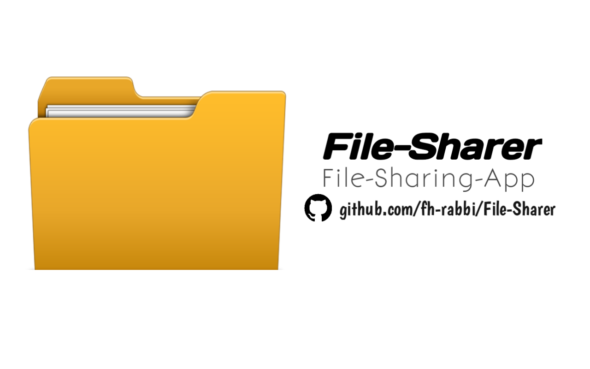
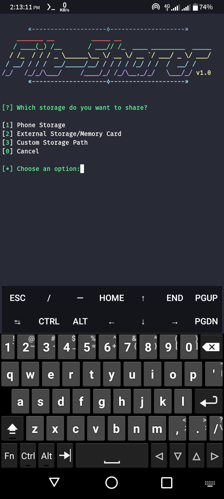
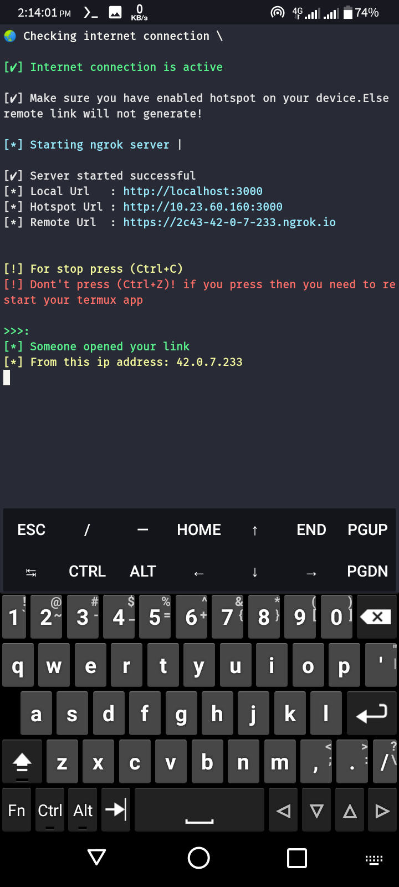

# ABOUT
The ultimate file sharing solution for Android devices! With File-Sharer web app, you can quickly and easily share files from your phone's storage over the internet with anyone, anywhere in this world.

Whether you're looking to share photos, documents, or music, File-Sharer makes it simple and secure. 

Try it out today and experience the power of seamless file sharing on your Android device!

### AVAILABLE ON :
* Termux

### TESTED ON :
* Termux

### REQUIREMENTS :
* internet
* git,nodejs-lts,python
* hotspot enabled
* storage 150 MB

### FEATURES :
* Share your internel storage
* Share your external storage
* Share any folder from your storage

### INSTALLATION [Termux] :
* **Important:**

	> If you have never used Termux before, after installing and opening Termux, you may encounter some errors when you try to install the package. To solve this error, use the termux-change-repo command to change the mirror.
	
	> Or you can take the help of YouTube.

* At first Download <a class="" href="#">Termux</a>
* Execute bellow command

* `termux-setup-storage` after executing this command give storage permiasion
* ### `Auto Install`
	
	* `bash <(curl -s https://raw.githubusercontent.com/fh-rabbi/File-Sharer/main/lib/install.sh)`
	
	* `start-file-sharer`
* ### `Manual Install`
	* pkg install git -y
	
	* pkg install python -y
	
	* pkg install nodejs-lts -y
	
	* git clone https://github.com/fh-rabbi/File-Sharer
	
	* cd File-Sharer
	
	* mv start-file-sharer /data/data/com.termux/files/usr/bin
	
	* cd /data/data/com.termux/files/usr/bin
	
	* chmod +x start-file-sharer
	
	* cd ..
	
	* python main.py/start-file-sharer

### SCREEN SHOTS [Termux]:

	
	

### WATCH VIDEO [Termux]:
<video src="" height="400px" width="100%" preload="none" autoplay="none"></video>

### Note:
* *Without hotspot links will not generate!*

* If you face any problem while installing this app you can message me on <a href="https://t.me/fhrabbi">Telegram</a>
